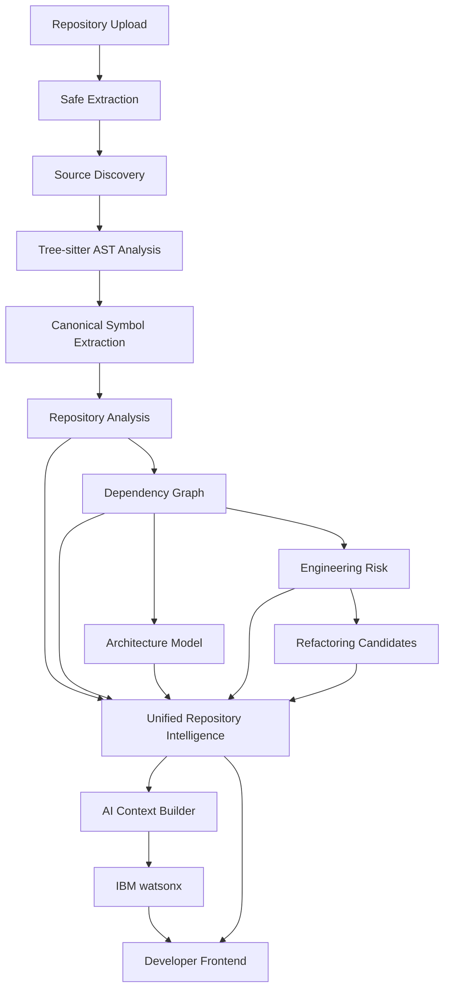

# CodeLens

**AI-Driven Code Intelligence and Automated Documentation System**

CodeLens is a modern developer tool that transforms unfamiliar, undocumented software repositories into structured, navigable, and understandable intelligence. 

Instead of treating source code as plain text and dumping it blindly into an LLM (which leads to hallucinations and missed context), CodeLens uses a **"Deterministic First, AI Second"** architecture. It parses code into Abstract Syntax Trees, builds precise dependency graphs, detects architectural components, and evaluates engineering health *before* asking the AI for interpretations.

## Core Capabilities

- 🌳 **Multi-Language AST Parsing**: Deterministically parses JavaScript, JSX, TypeScript, TSX, Python, Java, and C/C++ using Tree-sitter.
- 🕸️ **Dependency Intelligence**: Resolves imports (ESM, CommonJS, etc.) to build a complete node/edge dependency graph.
- 🏛️ **Architecture Intelligence**: Automatically groups files into components and architectural layers, visualized via Mermaid.
- 🏥 **Engineering Risk & Health**: Detects structural code smells like monolith files, cyclic dependencies, and high-coupling "God Objects".
- 🛠️ **Refactoring Intelligence**: Translates structural risks into prioritized, actionable refactoring strategies.
- ⚡ **Incremental Analysis**: Caches file ASTs using SHA-256 fingerprinting to ensure rapid re-analysis of large repositories.
- 💥 **Change Impact**: Predicts the blast radius of modifying specific files (useful for CI/CD).
- 🧠 **AI Repository Intelligence**: Integrates securely with **IBM watsonx** to answer questions, explain architectures, and generate automated documentation grounded *only* in deterministic facts.
- 🖥️ **Interactive Code Viewer**: A Monaco-powered frontend that highlights code and embeds AI references directly onto the relevant lines.

## Architecture Overview



## Technology Stack

- **Frontend**: React 18, Vite, Tailwind CSS, React Router, React Flow, Mermaid, Monaco Editor.
- **Backend**: Node.js 18+, Express, Multer.
- **Parsers**: `web-tree-sitter` v0.24.7, `tree-sitter-wasms` v0.1.13.
- **AI**: IBM watsonx SDK.
- **Testing**: Jest, Supertest.

## Repository Structure

```text
CodeLens/
├── client/              # React frontend
│   ├── src/
│   │   ├── api/         # Axios API definitions
│   │   ├── components/  # Reusable UI elements
│   │   └── pages/       # Route-level pages (Explorer, Architecture, Health)
│   └── package.json
├── server/              # Node.js backend
│   ├── src/
│   │   ├── analyzers/   # Pure deterministic engines (Tree-sitter, Graphs)
│   │   ├── ai/          # Context Builders and Watsonx integration
│   │   ├── controllers/ # Express route controllers
│   │   └── routes/      # Express API definitions
│   ├── tests/           # Jest test suites
│   └── package.json
├── docs/                # Comprehensive Knowledge Base
├── README.md            # You are here
└── package.json         # Workspace root
```

## Getting Started

See [docs/getting-started.md](docs/getting-started.md) for installation and `.env` configuration.

See [docs/development.md](docs/development.md) for instructions on running the application locally.

## Documentation Index

The complete documentation for developers, contributors, and maintainers can be found in the [docs/README.md](docs/README.md) directory. 

If you are an AI agent extending this codebase, you **MUST** read [AGENTS.md](AGENTS.md).
