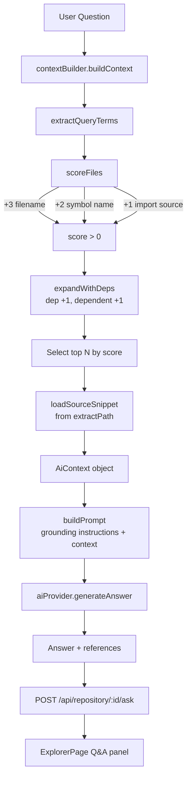

# AI Context Builder — Step 4

## Architecture



---

## Module Responsibilities

### `server/src/ai/aiProvider.js`

Provider abstraction. Exposes:

```js
generateAnswer(prompt: string): Promise<string>
isProviderConfigured(): boolean
```

Currently implements IBM watsonx.ai. The provider is selected by environment
variables at startup. Adding a new provider requires only a new function and
a one-line change to `getProvider()`.

### `server/src/ai/contextBuilder.js`

Builds the structured `AiContext` and the final prompt string. Exposes:

```js
buildContext(analysis, question, extractPath, opts?): AiContext
buildPrompt(context: AiContext): string
extractQueryTerms(question: string): string[]   // testable
extractSymbolNames(fileAnalysis): string[]       // testable
```

### `server/src/ai/askController.js`

Express handler for `POST /api/repository/:id/ask`. Validates input,
orchestrates context building, calls the AI, extracts references, returns
the structured response.

---

## Context Selection — Relevance Algorithm

### Query term extraction

The question is tokenised by splitting on non-word characters, lowercasing,
and removing stop words. Minimum token length: 2 characters.

```
"How does authentication work?"
→ tokens: ['authentication']
```

### File scoring

Each repository file gets a numeric relevance score:

| Signal | Points | Example |
|--------|--------|---------|
| Filename/path contains term | +3 | `authController.js` ↔ `authentication` |
| CamelCase stem part contains term | +3 | `AuthController` → `['auth','controller']` → `auth` in `authentication` |
| Symbol name matches term | +2 | symbol `login` ↔ `login` |
| Import source contains term | +1 | `require('express')` ↔ `express` |

Matching is bidirectional: `stem.includes(term) OR term.includes(stem)`.
CamelCase filenames are split before matching: `authController` → `['auth', 'controller']`.

### Dependency expansion

After initial scoring, direct dependencies and dependents of already-scored
files (score > 0) receive +1 each, so related files are pulled in even if
they don't directly match the query.

### Fallback

If no file scores > 0 (e.g. query is unrelated to the codebase), the first
`maxFiles` files are included with `reason: 'fallback'`.

### Context limits

| Limit | Default | Override via `opts` |
|-------|---------|---------------------|
| Max files in context | 8 | `maxFiles` |
| Max total source characters | 24 000 | `maxSourceChars` |
| Max symbols per file | 20 | `maxSymbolsPerFile` |
| Source lines around relevant symbol | 40 | `snippetLines` |

---

## AiContext Schema

```json
{
  "question": "How does authentication work?",
  "repository": {
    "name": "my-api",
    "totalFiles": 12,
    "languages": { "javascript": 10, "typescript": 2 }
  },
  "files": [
    {
      "path": "src/controllers/authController.js",
      "reason": "filename matches \"auth\"; symbol matches \"login\"",
      "score": 5,
      "symbols": ["login", "logout", "register", "refreshToken"],
      "dependencies": ["src/services/authService.js", "src/middleware/jwtMiddleware.js"],
      "dependents": ["src/routes/auth.js"],
      "source": "// Source snippet (first 40 lines around relevant symbol)\nasync function login(req, res) { ... }"
    },
    {
      "path": "src/services/authService.js",
      "reason": "dependency of authController.js",
      "score": 1,
      "symbols": ["validateCredentials", "generateToken", "revokeToken"],
      "dependencies": ["src/models/User.js"],
      "dependents": ["src/controllers/authController.js"],
      "source": "..."
    }
  ],
  "totalSourceChars": 4820,
  "truncated": false
}
```

---

## Prompt Structure

The prompt sent to the AI model contains:

1. **Grounding instructions** — explicit rules against fabricating files, functions, or dependencies
2. **Repository metadata** — name, file count, language summary
3. **File context blocks** — for each selected file:
   - File path
   - Reason for inclusion
   - Symbol names
   - Import relationships
   - Source snippet
4. **Truncation notice** (if context was cut)
5. **The question**
6. `Answer:` prefix to direct the model

---

## AI Provider Configuration

### IBM watsonx.ai (default)

Set these in `server/.env`:

```env
IBM_API_KEY=<IBM Cloud IAM API key>
IBM_PROJECT_ID=<watsonx.ai project ID>
IBM_API_URL=https://us-south.ml.cloud.ibm.com   # optional
IBM_MODEL_ID=ibm/granite-13b-instruct-v2         # optional
```

The provider uses IBM Cloud IAM for authentication. A fresh IAM token is
obtained for each request via `grant_type=apikey`.

**If not configured:** the `/ask` endpoint returns `HTTP 503` with
`{ error: '...', configured: false }`. The frontend displays this as an
error in the Q&A panel.

### Adding another provider

1. In `server/src/ai/aiProvider.js`, create an async function:
   ```js
   async function myProvider(prompt) {
     // call your API, return string
   }
   ```
2. Add detection logic in `getProvider()`:
   ```js
   if (process.env.MY_API_KEY) return myProvider;
   ```
3. Document the environment variables.
4. No other files need to change.

---

## API Reference

### `POST /api/repository/:id/ask`

Ask a natural-language question about an analyzed repository.

**Request:**
```json
{ "question": "How does authentication work?" }
```

**Response `200`:**
```json
{
  "question": "How does authentication work?",
  "answer": "The authentication flow starts in [src/controllers/authController.js] ...",
  "references": [
    { "path": "src/controllers/authController.js", "lines": null },
    { "path": "src/services/authService.js", "lines": "12-35" }
  ],
  "context": {
    "filesConsidered": 3,
    "totalSourceChars": 4820,
    "truncated": false,
    "files": [
      { "path": "src/controllers/authController.js", "reason": "filename matches \"auth\"", "score": 5 },
      { "path": "src/services/authService.js", "reason": "dependency of authController.js", "score": 1 }
    ]
  }
}
```

**Error responses:**

| Status | Condition |
|--------|-----------|
| `400` | Missing or empty question; question > 2000 chars |
| `202` | Repository still being analyzed |
| `404` | Repository not found or analysis unavailable |
| `409` | Repository not in `ready` state |
| `500` | Context build failure |
| `502` | AI provider call failed |
| `503` | AI provider not configured (`configured: false` in body) |

**File references in answer:**

The AI model is instructed to reference files using `[path/to/file.js]` or
`[path/to/file.js:10-25]` format. The `references` array is extracted by
parsing these patterns from the answer text.

---

## Grounding Rules

The AI prompt explicitly instructs the model to:

1. Answer using **only** the supplied repository context
2. **Never invent** files, functions, classes, or dependencies
3. Use `[path/to/file.js]` citation format for file references
4. **Explicitly acknowledge** when context is insufficient
5. Distinguish **evidence** (shown in code) from **inference** (deduced)
6. Prefer **precise technical explanations** over vague summaries

---

## Developer Guide

### Modifying relevance scoring

All scoring logic is in `scoreFiles()` in `server/src/ai/contextBuilder.js`.

To change score weights, modify the constants in the loop:
```js
score += 3;  // filename match — change to different weight
score += 2;  // symbol match
score += 1;  // import match
```

To add a new signal (e.g. +1 for files in the same directory as a matched file):
1. Add your logic inside the `scoreFiles()` loop.
2. Add tests in `server/tests/ai/contextBuilder.test.js`.

### Changing context limits

Pass `opts` to `buildContext()`:
```js
buildContext(analysis, question, extractPath, {
  maxFiles: 12,
  maxSourceChars: 48_000,
  maxSymbolsPerFile: 30,
  snippetLines: 60,
});
```

Or modify `DEFAULTS` in `contextBuilder.js` to change the global defaults.

### Debugging context generation

```js
const { buildContext, buildPrompt } = require('./src/ai/contextBuilder');
const context = buildContext(analysis, 'my question', extractPath);

// Inspect what was selected and why
context.files.forEach(f => console.log(f.path, 'score:', f.score, 'reason:', f.reason));

// See the exact prompt sent to the model
console.log(buildPrompt(context));
```

### Testing the AI layer

All tests are in `server/tests/ai/`. The AI provider is always mocked:
```bash
cd server && npm test
```

No real IBM API calls are made in tests.

---

## Security Notes

- API keys are read from environment variables only; never logged or returned to clients
- `extractPath` (internal filesystem path) is not included in any API response
- The question is validated (non-empty, max 2000 chars) before any processing
- Uploaded repository source code is never executed
- File reading uses `path.join(extractPath, relPath)` — no path traversal possible since `relPath` comes from the already-validated analysis

---

## Known Limitations

| Limitation | Notes |
|------------|-------|
| IAM token is fetched per request | Acceptable for low traffic; add caching if request rate increases |
| No conversation history | Each question is answered independently |
| Simple keyword matching only | No semantic/embedding-based retrieval yet |
| Only JS/TS files have symbol analysis | Other files matched by filename only |
| Long questions may produce more stop-word filtered tokens | Questions > ~10 meaningful words work best |
| IBM watsonx only | Other providers require code addition; well-documented above |
