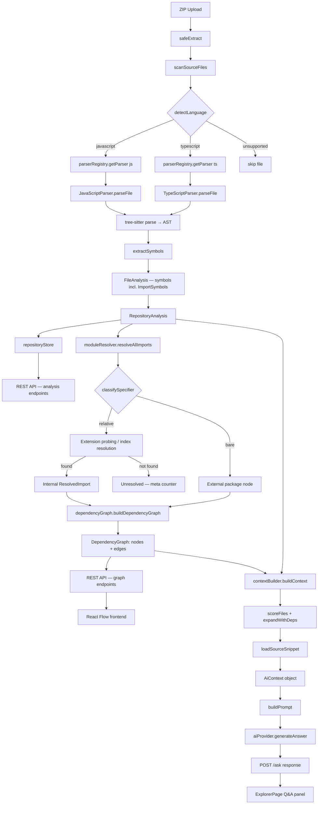

# Analysis Layer Architecture

## Overview

The analysis layer converts raw source files into structured symbol data that
powers all of CodeLens's intelligence features (dependency graphs, architecture
diagrams, API documentation, AI explanations).

## Full Data Flow (Steps 2 + 3)



## Module Responsibilities

### `languageDetector.js`
- Maps file extensions to language IDs (`'.ts'` → `'typescript'`)
- Pure data lookup, no side-effects
- Returns `null` for unsupported extensions (callers skip those files)

### `parserRegistry.js`
- Initialises `web-tree-sitter` once on first use
- Loads and caches grammar WASMs per language
- Returns a configured `Parser` instance via `getParser(languageId)`
- Adding a language requires only a one-line WASM map entry

### `symbols.js`
- Defines the canonical data model for all symbol types
- Factory functions: `createFunction`, `createClass`, `createMethod`, etc.
- `locationFromNode()`: converts tree-sitter 0-based rows to 1-based lines
- No parsing logic — pure data structure definitions

### `BaseParser.js`
- Abstract base class for all language parsers
- `parseFile(source, filePath)`: safe entry point — never throws
- Catches tree-sitter crashes and symbol extraction errors per file
- `extractSymbols()`: abstract method that subclasses must implement

### `JavaScriptParser.js`
- Extracts symbols from JavaScript (including JSX, CJS, ESM)
- Handles: functions, async functions, generators, arrow functions,
  classes, methods, ES imports, CommonJS requires, ES exports, CJS exports
- AST walker: depth-first, dispatches by node type
- `_extractParams()`: handles typed params (TS-aware), rest, default, destructuring
- **CommonJS require()**: emitted as `ImportSymbol` with `specifiers[].type = 'cjs-default' | 'cjs-named'`

### `TypeScriptParser.js`
- Extends `JavaScriptParser` — inherits all JS extraction
- Adds: interfaces, type aliases, abstract classes, access modifiers
- TypeScript-specific symbols carry a `tsKind` field: `'interface'` or `'type'`

### `repositoryAnalyzer.js`
- Scans all source files in a repository root directory
- Skips: `node_modules`, `dist`, `build`, `coverage`, and other build artefacts
- Skips: files > 512 KB (likely minified/generated)
- Fault-isolated: one file failure never aborts the rest
- Returns a `RepositoryAnalysis` with per-file results and summary statistics

### `moduleResolver.js` *(Step 3)*
- Classifies import specifiers: `relative` vs `external`
- Resolves relative specifiers to actual file paths using a 4-step algorithm:
  1. Exact match
  2. Extension probing (`.js`, `.jsx`, `.ts`, `.tsx`)
  3. Index file resolution (`<dir>/index.<ext>`)
  4. Unresolved (with reason)
- External specifiers (bare package names) are returned as-is
- `resolveAllImports()` iterates over every file in a `RepositoryAnalysis`

### `aiProvider.js` *(Step 4)*
- Provider abstraction: `generateAnswer(prompt)` + `isProviderConfigured()`
- IBM watsonx.ai implementation using IAM token exchange
- Configured via environment variables (`IBM_API_KEY`, `IBM_PROJECT_ID`, `IBM_API_URL`, `IBM_MODEL_ID`)
- `ProviderUnavailableError` for clean 503 responses when unconfigured
- Uses only Node.js built-in `https` module — no extra dependency

### `contextBuilder.js` *(Step 4)*
- `buildContext(analysis, question, extractPath, opts?)` → `AiContext`
- `buildPrompt(context)` → full prompt string with grounding instructions
- Relevance scoring: +3 filename/path match, +2 symbol match, +1 import match
- CamelCase filename splitting: `authController` → `['auth', 'controller']`
- Dependency expansion: direct deps/dependents of matched files get +1
- Source snippets: locates the relevant symbol's start line, returns N lines around it
- Fallback: first N files when nothing scores > 0

### `askController.js` *(Step 4)*
- Handles `POST /api/repository/:id/ask`
- Validates question (non-empty, max 2000 chars)
- Fast-path 503 when provider unconfigured (before building context)
- Extracts `[file.js:10-25]` references from AI response text

### `dependencyGraph.js` *(Step 3)*
- `buildDependencyGraph(analysis)`: builds nodes + edges from resolved imports
- Node types: `file` (repository source file), `package` (external npm package)
- Edge types: `imports` (ESM), `requires` (CJS)
- Deduplicates edges (same source→target pair kept once)
- Sorts nodes and edges deterministically for stable serialisation
- `getFileDependencies(graph, filePath)`: direct dependencies + dependents for one file
- `getIsolatedFiles(graph)`: files with no import or dependent edges
- `detectCycles(graph)`: iterative DFS — never crashes on circular deps

## Fault Isolation

```
repositoryAnalyzer
  └── analyzeFile(file1)   → FileAnalysis { error: null, symbols: [...] }
  └── analyzeFile(file2)   → FileAnalysis { hasErrors: true, symbols: [...] }  ← parse errors, still works
  └── analyzeFile(file3)   → FileAnalysis { error: "Cannot read file", symbols: [] }  ← IO error
  └── analyzeFile(file4)   → FileAnalysis { error: null, symbols: [...] }
```

A `FileAnalysis` with `error != null` is included in the results array but
counted as `errorFiles`. A `FileAnalysis` with `hasErrors: true` and no
`error` is counted as `analyzedFiles` — tree-sitter produced a partial AST.

Unresolved imports are counted in `meta.unresolvedImports` but are never
fabricated — they leave no edge in the graph.

## Performance Characteristics

- Parser initialisation: ~100–300ms (WASM load, once per process lifetime)
- Grammar load per language: ~50ms (once per language per process lifetime)
- Per-file parse: typically < 5ms for files under 512 KB
- File scanning is synchronous; file parsing is async (awaits WASM grammar load)
- Graph build: O(files × imports) — linear in the number of import statements
