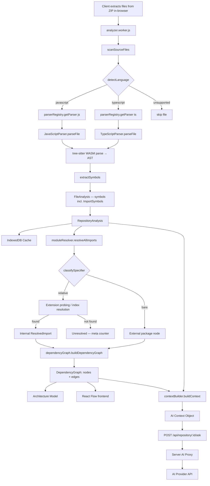

# Analysis Layer Architecture

> **Note:** As of ADR-012, all deterministic static analysis and file handling runs entirely in the **client browser (Web Worker)**. The server only proxies AI requests and stores zero information.

## Overview

The analysis layer converts raw source files into structured symbol data that powers all of CodeLens's intelligence features (dependency graphs, architecture diagrams, API documentation, AI explanations).

## Full Data Flow (Client-Side)

```mermaid
flowchart TD
    A[Client extracts files from ZIP in-browser] --> B[analyzer.worker.js]
    B --> C[scanSourceFiles]
    C --> D{detectLanguage}
    D -->|javascript| E[parserRegistry.getParser js]
    D -->|typescript| F[parserRegistry.getParser ts]
    D -->|unsupported| G[skip file]
    E --> H[JavaScriptParser.parseFile]
    F --> I[TypeScriptParser.parseFile]
    H --> J[tree-sitter WASM parse → AST]
    I --> J
    J --> K[extractSymbols]
    K --> L[FileAnalysis — symbols incl. ImportSymbols]
    L --> M[RepositoryAnalysis]
    M --> N[IndexedDB Cache]
    M --> P[moduleResolver.resolveAllImports]
    P --> Q{classifySpecifier}
    Q -->|relative| R[Extension probing / index resolution]
    Q -->|bare| S[External package node]
    R -->|found| T[Internal ResolvedImport]
    R -->|not found| U[Unresolved — meta counter]
    T --> V[dependencyGraph.buildDependencyGraph]
    S --> V
    V --> W[DependencyGraph: nodes + edges]
    W --> X[Architecture Model]
    W --> Y[React Flow frontend]
    M --> Z1[contextBuilder.buildContext]
    W --> Z1
    Z1 --> Z2[AI Context Object]
    Z2 --> Z3[POST /api/repository/:id/ask]
    Z3 --> Z4[Server AI Proxy]
    Z4 --> Z5[AI Provider API]
```

## Module Responsibilities

### `languageDetector.js`

- Maps file extensions to language IDs (`'.ts'` → `'typescript'`)
- Pure data lookup, no side-effects
- Returns `null` for unsupported extensions (callers skip those files)

### `parserRegistry.js`

- Initialises `web-tree-sitter` once on first use in the browser.
- Loads and caches grammar WASMs per language.
- Returns a configured `Parser` instance via `getParser(languageId)`.
- Adding a language requires only a one-line WASM map entry.

### `symbols.js`

- Defines the canonical data model for all symbol types
- Factory functions: `createFunction`, `createClass`, `createMethod`, etc.
- `locationFromNode()`: converts tree-sitter 0-based rows to 1-based lines
- No parsing logic — pure data structure definitions

### `BaseParser.js`

- Abstract base class for all language parsers
- `parseFile(source, filePath)`: safe entry point — never throws
- Catches tree-sitter crashes and symbol extraction errors per file
- `extractSymbols()`: abstract method that subclasses must implement

### `JavaScriptParser.js` & `TypeScriptParser.js`

- Extracts symbols from source code via AST traversal.
- Handles: functions, classes, imports, exports, interfaces, type aliases.
- Extracts parameters and access modifiers.

### `analyzer.worker.js`

- The core Web Worker that orchestrates the analysis off the main UI thread.
- Builds the RepositoryAnalysis, Dependency Graph, Architecture Model, and Risk Models.
- Communicates progress back to the UI via postMessage.

### `moduleResolver.js`

- Classifies import specifiers: `relative` vs `external`
- Resolves relative specifiers to actual file paths using a 4-step algorithm.

### `contextBuilder.js`

- Assembles the extracted symbols and dependency graph into a structured context payload to send to the server's AI proxy.

## Performance Characteristics

- Parser initialisation: ~100–300ms (WASM load, once per session)
- Grammar load per language: ~50ms
- Per-file parse: typically < 5ms for files under 512 KB
- Graph build: O(files × imports) — linear in the number of import statements
