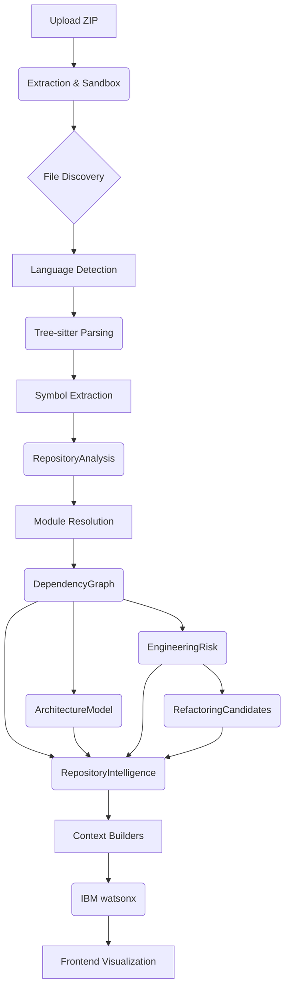

# Data Flow

This document details the complete end-to-end data lifecycle in CodeLens, from when a user uploads a repository to when the AI provides an insight.

## The Intelligence Pipeline

## Step-by-Step Breakdown

1. **Upload & Extraction (`repositoryController.js`)**: A ZIP file is uploaded to `POST /api/repository/upload`. It is extracted into a sanitized sandbox directory in the `.data/` folder.
2. **File Discovery (`repositoryAnalyzer.js`)**: The repository is scanned for valid source files while ignoring `.git`, `node_modules`, and binary assets.
3. **Language Detection (`languageDetector.js`)**: The language of each file is detected based on its extension.
4. **AST Parsing (`parserRegistry.js`)**: The appropriate `web-tree-sitter` grammar (JS, TS, Python, Java, C++) parses the file into an AST.
5. **Symbol Extraction (`JavaScriptParser.js`, etc.)**: Classes, functions, imports, and exports are extracted into canonical symbols.
6. **Repository Analysis**: A complete `RepositoryAnalysis` object is formed containing all files and symbols.
7. **Dependency Graph (`dependencyGraph.js`)**: `moduleResolver.js` resolves import paths (including CommonJS and ESM). A node/edge graph is built and cycles are detected.
8. **Architecture Intelligence (`architectureAnalyzer.js`)**: The graph is analyzed to group files into components (e.g., `client`, `server`, `utils`) and identify architectural entry points.
9. **Engineering Risk (`engineeringRiskAnalyzer.js`)**: Metrics like file size and coupling are used to score structural health.
10. **Refactoring Intelligence (`refactoringAnalyzer.js`)**: Concrete refactoring strategies are generated for high-risk files.
11. **Unified Repository Intelligence (`repositoryIntelligence.js`)**: Data across all previous stages is aggregated into a final dashboard summary, and hotspots are calculated.
12. **AI Context Building (`contextBuilder.js`)**: The deterministic models are serialized into a bounded JSON context.
13. **IBM watsonx**: The context is sent to the LLM to generate an explanation or answer a user's question.
14. **Frontend**: The structured response and data are rendered using React Flow, Mermaid, Monaco, and custom UI components.
