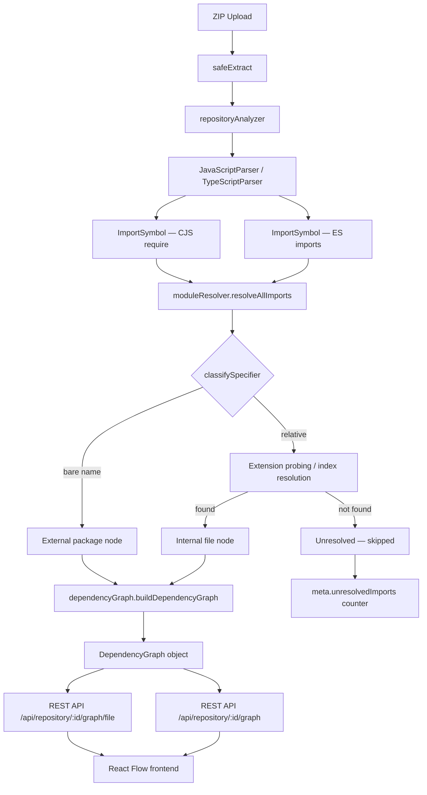

# Dependency Graph

## Architecture Overview



---

## Graph Data Model

### Node types

| Type | Description |
|------|-------------|
| `file` | A source file that exists inside the repository |
| `package` | An external npm/node package (bare specifier) |

#### File node schema

```json
{
  "id":       "file:src/controllers/authController.js",
  "type":     "file",
  "filePath": "src/controllers/authController.js"
}
```

#### Package node schema

```json
{
  "id":   "pkg:express",
  "type": "package",
  "name": "express"
}
```

---

### Edge types

| Type | Description |
|------|-------------|
| `imports` | ES module import statement (`import … from '…'`) |
| `requires` | CommonJS require() call (`require('…')`) |
| `depends_on` | Aggregated — reserved for future use |

#### Edge schema

```json
{
  "source": "file:src/controllers/authController.js",
  "target": "file:src/services/authService.js",
  "type":   "imports",
  "evidence": {
    "specifier":      "../services/authService",
    "importedNames":  ["login", "logout"],
    "location": {
      "startLine":   1,
      "startColumn": 0,
      "endLine":     1,
      "endColumn":   50
    }
  }
}
```

**Edge evidence fields:**

| Field | Type | Description |
|-------|------|-------------|
| `specifier` | string | The raw import/require string as written in source |
| `importedNames` | string[] | Bound names (named imports, aliases, or identifier) |
| `location` | Location\|null | Source position of the import statement |

---

### DependencyGraph schema

```json
{
  "nodes": [ /* Node[] */ ],
  "edges": [ /* Edge[] */ ],
  "meta": {
    "totalFiles":        9,
    "totalPackages":     4,
    "totalEdges":        14,
    "unresolvedImports": 2,
    "builtAt":           "2025-01-01T00:00:00.000Z"
  },
  "cycles":        [ ["src/a.js", "src/b.js", "src/a.js"] ],
  "isolatedFiles": [ "src/constants.js" ]
}
```

---

### Internal dependency example

```json
{
  "source": "file:src/controllers/authController.js",
  "target": "file:src/services/authService.js",
  "type":   "imports",
  "evidence": {
    "specifier": "../services/authService",
    "importedNames": ["login"],
    "location": { "startLine": 3, "startColumn": 0, "endLine": 3, "endColumn": 44 }
  }
}
```

### External dependency example

```json
{
  "source": "file:src/services/authService.js",
  "target": "pkg:jsonwebtoken",
  "type":   "imports",
  "evidence": {
    "specifier": "jsonwebtoken",
    "importedNames": ["sign", "verify"],
    "location": { "startLine": 2, "startColumn": 0, "endLine": 2, "endColumn": 42 }
  }
}
```

### Unresolved dependency

Unresolved imports are **not** added to the graph as edges. They are counted in `meta.unresolvedImports` and logged so they can be inspected.

---

## Module Resolution

### Algorithm

Given:
- `importingFile` — relative path of the file containing the import
- `specifier` — the raw import string (e.g. `./utils/helper`, `express`)
- `knownFiles` — Set of all repository file paths

**Step 1 — Classify the specifier**

| Specifier | Classification |
|-----------|---------------|
| Starts with `./` or `../` | `relative` → attempt file resolution |
| Anything else (bare name, `@org/pkg`) | `external` → package node, stop |

**Step 2 — Exact match**

Compute: `join(dirname(importingFile), specifier)`

If the result is in `knownFiles` → resolved (specifier already has an extension).

**Step 3 — Extension probing**

Append each extension in order: `.js` `.jsx` `.ts` `.tsx`

First match wins.

**Step 4 — Index file resolution**

Try: `<candidate>/index.js`, `<candidate>/index.jsx`, `<candidate>/index.ts`, `<candidate>/index.tsx`

First match wins.

**Step 5 — Unresolved**

Return `{ kind: 'unresolved', reason: '...' }`.

### Supported extensions

```
.js   .jsx   .ts   .tsx
```

Tried in that order — `.js` wins over `.jsx` when both exist.

### Examples

```text
importingFile: src/controllers/authController.js
specifier:     ../services/authService

→ Step 1: relative
→ Step 2: src/services/authService  (not in knownFiles)
→ Step 3: src/services/authService.js  ✓  (found)
→ resolvedTo: src/services/authService.js
```

```text
importingFile: src/app.js
specifier:     ./utils

→ Step 1: relative
→ Step 2: src/utils  (not in knownFiles)
→ Step 3: src/utils.js, src/utils.jsx, src/utils.ts, src/utils.tsx  (none found)
→ Step 4: src/utils/index.js  ✓  (found)
→ resolvedTo: src/utils/index.js
```

```text
importingFile: src/app.js
specifier:     express

→ Step 1: external
→ resolvedTo: null, kind: 'external'
```

### Limitations

- No `tsconfig.json` path aliases (`@/components/Button` → unresolved)
- No `package.json` `"exports"` field
- No webpack / vite alias resolution
- No `http://` URL imports
- CSS, JSON, and asset imports remain unresolved
- Only `.js`, `.jsx`, `.ts`, `.tsx` extensions are probed

---

## API Reference

### `GET /api/repository/:id/graph`

Returns the full dependency graph for a repository.

**Parameters:**

| Name | In | Type | Description |
|------|----|------|-------------|
| `id` | path | string | Repository UUID |

**Response `200`:**

```json
{
  "nodes": [
    { "id": "file:src/app.js",   "type": "file",    "filePath": "src/app.js" },
    { "id": "pkg:express",        "type": "package", "name": "express" }
  ],
  "edges": [
    {
      "source":   "file:src/app.js",
      "target":   "pkg:express",
      "type":     "imports",
      "evidence": { "specifier": "express", "importedNames": ["Router"], "location": null }
    }
  ],
  "meta": {
    "totalFiles": 5,
    "totalPackages": 2,
    "totalEdges": 7,
    "unresolvedImports": 0,
    "builtAt": "2025-01-01T00:00:00.000Z"
  },
  "cycles": [],
  "isolatedFiles": []
}
```

**Error responses:**

| Status | Condition |
|--------|-----------|
| `404` | Repository not found |
| `202` | Repository still being analyzed |
| `409` | Repository not in `ready` state |
| `500` | Graph build failed |

---

### `GET /api/repository/:id/graph/file?path=<filePath>`

Returns dependencies and dependents for a single file.

**Parameters:**

| Name | In | Type | Description |
|------|----|------|-------------|
| `id` | path | string | Repository UUID |
| `path` | query | string | Relative file path (e.g. `src/app.js`) |

**Response `200`:**

```json
{
  "filePath": "src/controllers/authController.js",
  "dependencies": [
    {
      "filePath": "src/services/authService.js",
      "edgeType": "imports",
      "evidence": { "specifier": "../services/authService", "importedNames": ["login"], "location": null }
    },
    {
      "package":  "jsonwebtoken",
      "edgeType": "imports",
      "evidence": { "specifier": "jsonwebtoken", "importedNames": ["sign"], "location": null }
    }
  ],
  "dependents": [
    {
      "filePath": "src/routes/auth.js",
      "edgeType": "imports",
      "evidence": { "specifier": "../controllers/authController", "importedNames": ["login"], "location": null }
    }
  ],
  "externalPackages": ["jsonwebtoken"],
  "dependencyCount": 2,
  "dependentCount": 1
}
```

**Error responses:**

| Status | Condition |
|--------|-----------|
| `400` | Missing `path` query parameter |
| `404` | Repository or file not found |
| `409` | Repository not ready |
| `500` | Graph query failed |

---

## Developer Guide

### Inspecting the graph

```javascript
const { buildDependencyGraph } = require('./src/analyzers/dependencyGraph');
const { analyzeRepository }    = require('./src/analyzers/repositoryAnalyzer');

const analysis = await analyzeRepository('/path/to/repo');
const graph    = buildDependencyGraph(analysis);

// All nodes
console.log(graph.nodes);

// All edges
console.log(graph.edges);

// Stats
console.log(graph.meta);
```

### Debugging unresolved imports

Unresolved imports are counted in `meta.unresolvedImports` but not represented as edges.

To inspect them, call `resolveAllImports` directly:

```javascript
const { resolveAllImports, buildKnownFilesSet } = require('./src/analyzers/moduleResolver');

const knownFiles = buildKnownFilesSet(analysis);
const resolved   = resolveAllImports(analysis, knownFiles);

for (const [filePath, imports] of resolved) {
  const unresolved = imports.filter(i => i.kind === 'unresolved');
  if (unresolved.length > 0) {
    console.log(`${filePath} has ${unresolved.length} unresolved imports:`);
    unresolved.forEach(u => console.log(`  ${u.specifier}: ${u.reason}`));
  }
}
```

### Adding a new resolution rule

All resolution logic lives in [`server/src/analyzers/moduleResolver.js`](../server/src/analyzers/moduleResolver.js) in the `resolveImport()` function.

To add a new rule (e.g. support `.mjs` extension):

1. Add `'.mjs'` to the `RESOLUTION_EXTENSIONS` array.
2. The extension probing loop (Steps 3 and 4) will automatically try it.

To support `tsconfig.json` path aliases:

1. Parse `tsconfig.json` in `repositoryAnalyzer.js` to extract `paths` aliases.
2. Pass the alias map into `resolveImport()`.
3. Add a new step before Step 2 that checks alias matches.

### Extending to a new language

1. Add a parser for the language in `server/src/analyzers/` extending `BaseParser`.
2. Ensure the parser emits `ImportSymbol` objects with `kind: 'import'` using `createImport()`.
3. Set `specifier.type` to `'cjs-default'`/`'cjs-named'` for CommonJS-style imports, or `'default'`/`'named'`/`'namespace'` for ESM-style.
4. Register the parser in `repositoryAnalyzer.js` `PARSER_FACTORIES`.
5. The module resolver and graph builder will pick it up automatically.

---

## Testing

### Test files

| File | What it tests |
|------|---------------|
| `server/tests/analyzers/dependencyGraph.test.js` | Graph builder, nodes, edges, meta, cycles, isolation, derived queries |
| `server/tests/analyzers/commonJsRequire.test.js` | CJS require() extraction in JavaScriptParser |
| `server/tests/analyzers/moduleResolver.test.js` | Module resolution algorithm (all steps) |
| `server/tests/analyzers/JavaScriptParser.test.js` | Full JS symbol extraction (Step 2 regression) |
| `server/tests/analyzers/TypeScriptParser.test.js` | Full TS symbol extraction (Step 2 regression) |
| `server/tests/analyzers/repositoryAnalyzer.test.js` | Repository scan + analysis (Step 2 regression) |
| `server/tests/analyzers/parserRegistry.test.js` | Parser caching (Step 2 regression) |
| `server/tests/analyzers/languageDetector.test.js` | Language detection (Step 2 regression) |

### Running tests

```bash
cd server
npm test
```

### Expected results

```
Test Suites: 8 passed, 8 total
Tests:       209 passed, 209 total
```

### Known limitations

- Path alias resolution (`@/`, `~/`, etc.) is not supported — these appear as unresolved imports.
- Dynamic `import()` expressions are not extracted (only static `import` statements and `require()` calls).
- Barrel files (`export * from '…'`) create an export symbol but the re-export source is not added as a dependency edge (only import symbols feed the graph).
- `require()` calls inside `if` blocks or callbacks are not extracted — only top-level variable declarations are supported.

---

## Dependency Graph → Code Viewer Navigation

When interacting with the Dependency Graph in the React UI, users can navigate from an internal file node directly to the Monaco Code Viewer (Explorer).

**Navigation Flow:**
1. User selects a blue (internal) file node in the dependency graph.
2. The right-hand File Detail Panel populates with dependency data.
3. User clicks the **"View in Explorer"** button (or the "View" link next to a specific dependency).
4. The user is navigated to the Explorer route via a deep-link.

**Route format:**
```
/explore/:repoId?path=<encoded-file-path>
```
Example: `/explore/1234-abcd?path=src%2Fcontrollers%2FauthController.js`

**Path Handling:**
- The `path` parameter is strictly URI-encoded to safely handle spaces and special characters.
- The `ExplorerPage` reads the `path` and `line` (optional) query parameters on mount.
- External packages (e.g. `express`) do not expose a "View in Explorer" action because they are not part of the analyzed repository source.
