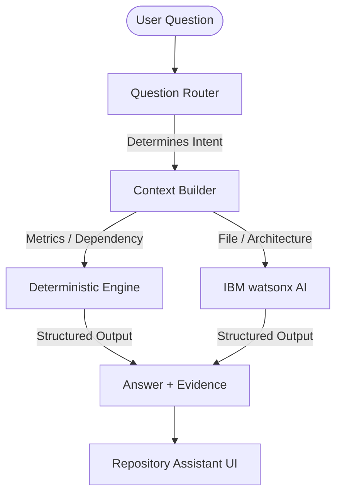

# Repository Intelligence & Contextual Q&A

**Step 8** of CodeLens introduces advanced Repository Intelligence and Contextual Code Q&A. Instead of relying purely on an LLM to read and understand the entire repository, CodeLens routes questions through a deterministic extraction pipeline.

## Architecture

## Intent Classification
Questions are categorized into intents (`METRICS`, `DEPENDENCY`, `ARCHITECTURE`, `FILE_EXPLANATION`, `GENERAL`). Based on the intent, CodeLens decides what context to pull (architecture layer info, dependency graphs, or raw file source) and whether AI is strictly necessary.

## Deterministic vs. AI-Assisted Answers
- **Deterministic-First:** Questions like "What depends on `auth.js`?" or "How many files in the repo?" are answered by querying the existing `DependencyGraph` and `RepositoryAnalysis` directly. This bypasses the AI provider, saving time, cost, and ensuring 100% accuracy.
- **AI-Assisted:** Questions like "How does authentication work?" are sent to IBM watsonx. However, instead of a raw code dump, the AI is provided with a curated context of relevant files, their exports/imports, and dependency connections, minimizing token usage and reducing hallucinations.

## Graceful AI Fallback
If watsonx is unavailable, the AI provider gracefully falls back to returning the deterministic facts gathered during context extraction, ensuring the Assistant is always somewhat useful.

## Strict Source Referencing
The backend enforces that the AI structures its response as a specific JSON object. This structure guarantees a clear separation between:
1. **Summary & Explanation**
2. **Grounded Facts** (Deterministically proven)
3. **AI Inferences** (Conclusions drawn by the LLM)
4. **Source References** (Precise file paths and line ranges)

These references are fully clickable in the UI, navigating the developer directly to the relevant line in the Monaco Code Viewer.
